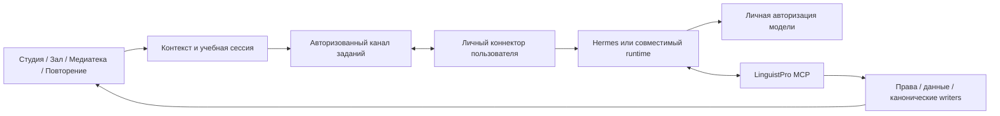

# Зрелый наставник LinguistPro: продукт и архитектура BYOA

Дата: 2026-09-29. Исходный код: `390486d3`, совпадал с `origin/main` при исследовании.
Статус: **исследование и проект реализации; новый runtime не реализован и не опубликован**.
Решение владельца в этой сессии: **каждый пользователь подключает собственную подписку/агента; расходы LinguistPro минимальны**. Личный путь владельца — Hermes → ChatGPT/Codex OAuth, без `OPENAI_API_KEY` и платного API fallback.

Доказательства, ограничения и источники: [аудит](../research/mentor-byoa/2026-09-29/AUDIT.md).
Задачи, зависимости, критерии и переход Hermes: [план исполнения](MENTOR_BYOA_EXECUTION_2026_09_29.md).

## 1. Продуктовое решение

Одна видимая сущность **«Наставник»**, доступная в Студии, Зале, Медиатеке и Повторении. Она понимает выбранный фрагмент, помогает выполнить учебное действие и возвращает в исходное занятие. Общая история занятий, настройки и память сохраняются при переходе между разделами и при смене совместимого агента.

Цель: ученик лучше понимает новый ивритский материал и самостоятельно использует изученное спустя время. Количество сообщений, созданных карточек и длительность диалога — вспомогательные показатели. Обещание «уровень профессионального преподавателя» требует отдельной оценки качества; fluent-ответ сам по себе не доказывает эту планку.

Базовый пользовательский цикл:

`реальный материал → вопрос/попытка → объяснение или подсказка → самостоятельная попытка → разбор → возврат к материалу → проверка позже в новом контексте`.

Прямой вопрос пользователя получает прямое объяснение. Наставник предлагает практику, но не вынуждает проходить экзамен ради ответа. В режиме упражнения ответ раскрывается по запросу; показ ответа отмечается как помощь.

## 2. Что сохраняем и что меняем

Существующие компоненты — предшественники, а не готовый массовый продукт. Июльские статусы CLOSED/owner-live относятся к их ограниченным сценариям.

| Область | Переиспользуем | Требуется |
| --- | --- | --- |
| Студия | notes queue, frontier quiz, sentence anchors, material pipeline | Осмысленный «Заняться материалом»: цель → короткая сессия → результат; отдельное редактирование заметок |
| Зал | reader, морфология на тапе, `MentorHome`, существующие explain/talk/writing | Общая контекстная панель, сохранение позиции, последовательный учебный сценарий |
| Медиатека | тема/подборка/материал, опубликованные редакции, проигрыватель | Подбор под цель, занятие по проверенному фрагменту, работа с речью/субтитрами |
| Повторение | канонический challenge/grader, `review_log`, FSRS | Объяснение ошибки, различение похожих форм, возврат в ту же очередь без повторной оценки |
| Память | F1: заявленные цели и незавершённые нити | Профиль предпочтений и версионируемое резюме, привязанное к свидетельствам |
| Учебные свидетельства | F2, channel-aware review history | Отдельные измерения грамматики, понимания и продукции; калибровка до mastery-утверждений |
| MCP | 31 объявленная capability, OAuth, text grants, proposals/receipts | Текущий контекст, сессии, учебные результаты, события и capability negotiation |
| Hermes | личный runtime, инструменты, teaching skills | Совместимый обновлённый runtime, OAuth, минимум прав, адаптер к общему учебному контракту |

F1 сейчас не хранит полную модель знания слов и грамматики: его типы — `declared_goal` и `unfinished_thread`. `get_learner_profile` сейчас возвращает mode/language/depth; уровень A2 и «слабое прошедшее время» из него получить нельзя. F2 — ограниченные shadow-свидетельства; не включать их автоматически в педагогические решения через скрытые флаги.

## 3. Один наставник, несколько режимов работы

| Режим | Когда включается | Результат |
| --- | --- | --- |
| Объяснить | Вопрос по слову, предложению, обороту | Короткое объяснение + точный пример + по желанию проверка |
| Потренироваться | Явный запрос или принятое предложение | Одна цель, несколько заданий, обратная связь, итог |
| Поговорить | Свободный разговор/ролевая ситуация/обсуждение текста | Диалог по выбранной теме, дозированные исправления, итоговые примеры |
| Проверить написанное | Собственная реплика, пересказ, сообщение | Смысл, ошибки по приоритету, правка и самостоятельная повторная попытка |
| Выбрать следующий шаг | Начало/завершение занятия | Одна объяснимая рекомендация, длительность, доступная альтернатива |

У каждого режима свой контракт задания и оценки, но единый профиль ученика. По умолчанию — один оркестратор с ограниченными функциями. Отдельные модели/специалисты допустимы за интерфейсом после сравнения качества и задержки. Пользователь не должен разбираться, какого из пяти ботов спросить, и переносить между ними контекст. Отдельные персональности — поздняя пользовательская настройка, без отдельных конкурирующих моделей знания.

Языковой наставник различает современный разговорный, формальный и литературный/библейский регистр. Классический корпус не становится источником бытовой речи без такой маркировки. Для STEM-материала языковая помощь отделена от проверки предметного решения; существующий reviewed support имеет собственное происхождение и право доступа.

## 4. Основные пользовательские сценарии

| Точка входа | Действия наставника | Завершение и проверка |
| --- | --- | --- |
| Слово/строка в Студии или Зале | Видит выделение и соседний контекст; объясняет выбранное чтение; признаёт омографию | Закрытие возвращает к строке; «Проверить себя» открывает одно связанное задание |
| «Заняться материалом» над таблицей | Предлагает понимание, полезные выражения или конкретную грамматику; показывает цель и 3–5 минут | 2–4 задания + собственная реплика + краткий итог; число является начальной UX-гипотезой |
| Конец текста | Предлагает краткий пересказ/выбор смысла; при достаточных данных — один пробел | Самостоятельная попытка, одна приоритетная правка, возврат/сохранение выбранного результата |
| Карточка Медиатеки | Показывает пригодность под цель, готовность транскрипта/тайминга, регистр, длительность | Открывает существующий материал по каноническому ID; не запускает платный ingest скрыто |
| Видео/аудио | Работает по выбранному временному окну и версии субтитров; предлагает прослушивание и пересказ | При плохой синхронизации — текстовая работа с явным статусом; без утверждения «ты не расслышал» |
| Ошибка в Повторении | «Почему?» и «Сравнить» после реальной попытки; помогает исправить | Та же очередь и позиция; текущая оценка не записывается повторно; подсказанный drill отдельно |
| Разговор | Цель/ситуация, удобный темп; критичное непонимание уточняет сразу; остальные правки — в естественной паузе | 1–2 приоритетные правки, исправленная собственная реплика, предлагаемый следующий шаг |
| Начало следующего занятия | Возвращает незавершённую нить или выбирает короткую практику из фактов | «Почему это?» показывает наблюдения, а не фиктивные проценты владения |

Заметки, квиз и study-summary не удаляются до переноса их полезных действий. Названия «обзор кандидатов» и «i+1» уходят из основного пользовательского меню; профессиональные параметры остаются в расширенных настройках.

## 5. Интерфейс

На desktop — панель рядом с источником; на узком экране — полноэкранный лист с коротким закреплённым фрагментом и кнопкой возврата. Во всех разделах одинаковые действия, состояния и история текущего занятия. Исходный скролл, выделение, позиция медиаплеера и очередь сохраняются. Переключение материала не подменяет уже отправленный контекст.

Пример смыслового состава панели (не готовый визуальный макет):

```text
Наставник                         [Закрыть]
По этому предложению · [Показать источник]
כשהייתי ילד גרתי בחיפה

הייתי — «я был»: речь о самом говорящем.
היה — «он был».

[Проверить себя] [Другой пример]
[Ваш вопрос…                         →]
```

Во время занятия: цель, текущий шаг, «Подсказка», «Показать ответ», «Закончить». В итоге: что сделано, что получилось самостоятельно, что стоит повторить, выбранные артефакты. Не показывать внутренние tool calls, scopes и JSON в обычном учебном потоке.

Дом наставника: «Продолжить», один следующий шаг, недавние занятия, затем настройки. Подключение и диагностика не занимают главный экран постоянно. Профиль: цель, предпочитаемый язык объяснений, ориентировочное время, интересы, режим вмешательства; всё можно пропустить и изменить. Уровень сначала самооценка/неизвестен, затем отдельные наблюдения по навыкам. Постепенное уменьшение перевода/транслита — предложение с отменой, а не скрытая настройка.

Качество UI: RU/EN/HE, логические CSS-свойства и смешанный RTL/LTR, корректное выделение никуда, keyboard/focus/escape, screen-reader announcements, mobile keyboard и safe-area, цели касания ≥44 px, reduced motion. Проверять 360/390/768/1280 px и длинный текст; физические iPhone/Android и AT — отдельные приёмки.

## 6. Подключение собственного агента

Основной продуктовый маршрут — BYOA (bring your own agent). Встроенного inference за счёт LinguistPro в этот план не входит. Платные API возможны только как отдельно выбранная пользователем возможность его собственного runtime; в профиле владельца они запрещены.

**Два различных направления связи:**

1. LinguistPro → личный runtime: запрос объяснения/занятия из интерфейса приложения.
2. Личный runtime → LinguistPro MCP: чтение разрешённых учебных данных и предложения действий.

Наличие MCP покрывает второе направление и не создаёт первое. Нужен адаптер сессий и транспорта, а не только новые MCP tools.



### Мастер первого запуска

1. Пользователь нажимает «Подключить наставника». Видит «У меня есть агент» и «Настроить личного агента» с требованиями по устройствам.
2. Для рекомендуемого коннектора — установка подписанного приложения/пакета одной операцией. Оно обнаруживает существующий совместимый Hermes или ставит изолированный tutor runtime. Не требует терминала, Docker или Tailscale от массового пользователя. Уже имеющуюся установку автоматически не перезаписывает.
3. «Войти через ChatGPT/Codex» открывает поддерживаемый самим runtime OAuth. Пароль и provider tokens остаются у runtime. Показываем только реально доступные этому аккаунту модели; статический список из документации не является проверкой доступа.
4. «Разрешить связь с LinguistPro» — PKCE/pairing и понятное согласие на выбранные данные. Это другая авторизация. Базовый фрагмент, история обучения, постоянная память, микрофон и уведомления имеют раздельные разрешения.
5. Автотест: подлинность коннектора → способности модели → read-only MCP → учебный пример → готово. При исчерпании подписки сохраняем настройку и объясняем состояние. Демо с реальной моделью выполняется после явного запуска пользователем.
6. Вернуться в исходный фрагмент автоматически. Расширенные права запрашиваются в момент первого соответствующего действия, а не списком десятков scopes.

Целевой UX: один запуск установки, два понятных входа/разрешения, первый учебный результат без копирования ключей и конфигов. Число кликов и время проверяются на новых пользователях; «нулевой порог» означает отсутствие технической настройки, а не обход обязательной авторизации.

Telegram — дополнительный канал напоминаний, синхронизация — отдельная возможность, не предпосылки объяснения выбранного фрагмента. Для локального OPFS-текста коннектор получает только разрешённое окно из текущего браузера; внешнему MCP не приписывается доступ к локальной библиотеке.

### Доступность по устройствам

| Вариант | Преимущество | Условие |
| --- | --- | --- |
| Личный коннектор на компьютере | Личная подписка, автоматическая настройка, встроенный UX | Компьютер и runtime включены; сон виден как «Агент не в сети» |
| Личный постоянно работающий сервер/провайдер агента | Работа с телефона без домашнего компьютера | Хостинг и модель оплачивает/предоставляет пользователь; нужен совместимый адаптер |
| Внешний чат с MCP | Минимальный путь для уже установленного агента | Контекст передаётся через явный handoff; встраивание в UI и обратная доставка зависят от платформы |
| Нет доступного runtime | Чтение, существующее повторение, сохранённые объяснения | Новая генерация не симулируется; предложить подключение/повторить позже |

Web PWA не должна молча ходить из HTTPS на `http://127.0.0.1` или сканировать локальную сеть. Для общего маршрута — исходящий аутентифицированный канал коннектора к relay LinguistPro; никакого публичного управления домашним компьютером. Tailscale полезен владельцу, но не становится обязательным условием массового подключения.

## 7. Учебная модель и грамматика

Единицы учёта: значение слова в контексте; морфологическая форма; грамматическая конструкция; понимание; самостоятельная письменная/устная продукция. Навыки связаны, но не взаимозаменяемы. Знание לָלֶכֶת не доказывает способность произнести הָלַכְתִּי.

Сначала — **тонкий каталог грамматики**, затем расширение. Первые темы: личные/родовые формы היה; прошедшее время 1-го лица; согласование; определённость и את; отрицание/вопрос; предлоги с местоименными суффиксами; סמיכות. Точный объём первой поставки определяется независимой языковой редактурой; биньяны добавляются с проверенными примерами и исключениями.

`concept_id`, названия RU/HE/EN, регистр, prerequisites, правило, границы/исключения, пары примеров/контрпримеров, типичные ошибки, допустимые формы ответа, ссылки на источники и статус языковой проверки — минимальная карточка конструкции. Переиспользовать `agent/constructs.js`, вводя новую версию реестра, а не второй namespace без миграции.

Реестр отделён от обнаружения в тексте: модель может предложить связь с существующей конструкцией; NLP/правила/редактор задают доказательство и уверенность. При слабом разборе наставник формулирует возможное чтение и уточняет контекст. Даже детерминированные NLP-компоненты могут ошибаться; происхождение/неопределённость сохраняются.

Учебная последовательность: увидеть смысл → заметить различие → выбрать/восстановить форму → составить собственную реплику → применить в другом контексте позже. На раннем этапе смешивать новую грамматику преимущественно со знакомой лексикой. «i+1» — педагогическая эвристика, не точно вычисленное число сложности по одной доле знакомых слов.

Состояния навыка до калибровки: «ещё не проверяли», «получилось с подсказкой», «получилось самостоятельно», «повторно получилось в новом контексте». Хранить количество/давность/канал/помощь, а не отображать выдуманные `mastery=0.91`. Экспозиция, клик, время на странице и ошибки ASR не становятся оценками знания.

Детерминированные проверяемые задания могут давать каноническое review-событие через существующий writer. Открытый пересказ/диалог сначала даёт advisory feedback и отдельное свидетельство. Второй LLM-вызов того же семейства не равен независимому gold-оцениванию. Нужны экспертный эталон, возможность оспорить оценку и сравнение с реальной самостоятельной работой.

## 8. Артефакты и инициатива

Полезные выходы: краткая заметка по трудному месту; исправленная собственная реплика; мини-набор контрастных примеров; упражнение; краткий итог занятия; цель/незавершённая нить. Каждый связан с исходным материалом и редакцией, целевым навыком, попыткой и видом помощи. Сохранение в библиотеку/повторение — preview/подтверждение через существующие proposals. Разрешённое автосохранение черновиков — отдельная настройка; оно не означает запись mastery или публикацию.

Жизненный цикл: `draft → validated → accepted → superseded/archived/deleted`. При исправлении исходного транскрипта зависимые упражнения получают stale-статус; повторная проверка не меняет исходник. Дедупликация по источнику/редакции/цели/нормализованному содержимому. Экспорт/удаление охватывают чат, summaries, очередь и кэши, включая восстановление из резервной копии.

Модель инициативы использует имеющиеся Silent / Coach / Intensive:

- Silent: только по запросу; подходит для первого запуска.
- Coach: короткое предложение после ошибки или завершения фрагмента; стартовый предел — одно предложение за занятие, затем измерять усталость и пользу.
- Intensive: заранее согласованное занятие с большей активностью и явной паузой/выходом.

До любой генерации правила проверяют согласие, свежесть данных, незавершённое занятие, доступность runtime, квоту и cooldown. События собираются/объединяются локально; не один LLM-вызов на каждый клик. «Позже» и пропуск не являются неуспехом. Напоминания только по opt-in; SRS остаётся в LinguistPro, Hermes cron не создаёт второй календарь повторений.

## 9. Контракты данных, MCP и сессий

Общий `ContextEnvelope v1` для внутренних UI и внешних агентов:

```text
context_id, schema_version, issued_at, expires_at
principal_binding (задаётся сервером, не user_id из LLM)
surface, session_id, source_kind, material_id, revision_id
sentence_id/span, token_span?, media_time_window?, caption_revision?
source_excerpt, excerpt_digest, surrounding_context
evidence_refs[], authority_labels[], learner_summary_revision
capabilities[], consent_snapshot_ref, locale, instructional_intent
```

Для локальных источников браузер создаёт ограниченный snapshot с точной редакцией и разрешением отправки. Сервер не считает клиентские заявления о mastered/scope/owner достоверными. Смена вкладки не изменяет контекст уже идущей сессии. Ссылка «источник» использует существующий [контракт адресов](LINK_ARCHITECTURE_2026_09_29.md); идентичность материала/редакции важнее названия и номера строки.

| Дополнение MCP (предлагаемые имена) | Назначение и предел |
| --- | --- |
| `get_tutor_capabilities` | Версия схем, доступные режимы/форматы, соединение; никаких токенов |
| `get_active_learning_context` | Только явно переданный `context_id`, TTL и scope; без фонового чтения произвольной вкладки |
| `get_learning_evidence` | Ограниченная история по навыку/слову, помощь, давность, неопределённость |
| `get_grammar_concept` | Проверенная карточка конструкции и её версия |
| `get_material_learning_context` | Разрешённое окно текста/субтитров, редакция, ссылки, качество тайминга |
| `create_tutor_session` / `get_tutor_session` | Цель, источник, шаги, продолжение; только свой principal |
| `propose_learning_artifact` | Черновик с происхождением и preview; исполнение остаётся за существующим writer |
| `submit_tutor_attempt` | Ссылка на выданное challenge, ответ, помощь, idempotency key; сервер выбирает допустимую оценку |
| `propose_session_summary` | Проверяемое резюме и незавершённые нити; без записи скрытых черт личности |

Существующие morphology/coverage/due/profile/publication/propose tools расширяются совместимо. Не добавлять универсальные `execute_sql`, `set_mastery`, `schedule_review(date)` и произвольный `grade_answer(correct=true)`. Capabilities должны включать допустимые действия, а не обещать поддержку по названию провайдера.

Состояния сессии: `CREATED → CONTEXT_READY → RUNNING ↔ WAITING_FOR_USER → COMPLETED`, дополнительно `PAUSED/CANCELLED/FAILED/EXPIRED`. События стрима: `accepted`, `progress`, `content_delta`, `exercise_ready`, `awaiting_answer`, `completed`, `failed`; monotonic sequence, reconnect cursor, дедупликация. Интерфейс не считает конец HTTP-stream успешным концом занятия.

## 10. Масштабирование и доверие

Сначала модульный Node.js-контур в существующем проекте; вынести только transport/relay worker, если нужны долгие соединения. Очередь с lease, heartbeat, bounded retries, дедлайном и идемпотентным завершением; at-least-once доставка не должна давать повторную оценку. Нагрузку задают одновременно активные занятия и размеры окон контекста, а не общее число регистраций.

Credential/runtime/session/cache изолируются по пользователю и соединению. Личный OAuth не копируется между несколькими независимо обновляющими его процессами. Relay не хранит provider tokens и не является универсальным OpenAI proxy. Для ephemeral личных фрагментов целевой транспорт — шифрование браузер↔коннектор с привязкой ключа при pairing; если первый прототип использует серверную обработку plaintext, это отдельный явно описанный режим, без заявления E2EE. Диагностика не сохраняет содержимое фрагментов по умолчанию.

Агентский tutor profile имеет только учебные tools; shell, файловая система пользователя, email и самостоятельное изменение skills ему не нужны. Импортированный текст/субтитры/ответ инструмента — данные, не инструкции. Grant проверяется на каждом tool call и при принятии результата; отзыв соединения отменяет доступ, ожидающие jobs и приём старых результатов. Конкурирующие устройства используют версии/receipts существующего OPFS-sync пути.

Модель оплаты: inference за счёт личного доступа; LinguistPro оплачивает relay, хранение метаданных, трафик, поддержку и редактуру. Лимиты: размер контекста, число параллельных занятий/соединений, TTL очереди/артефактов, контроль abuse. BYOA уменьшает inference bill, но не делает эксплуатацию бесплатной. Перед масштабированием измерить `relay_cost/active_learner`, `support_minutes/activation`, долю offline-runtime, failed onboarding, токены/занятие и вызовы инструментов. Не фиксировать денежные оценки без замеров.

## 11. Голос

Текстовая подписочная модель и ASR/TTS/realtime — отдельные способности. ChatGPT OAuth в Hermes не доказывает доступ к OpenAI Realtime/TTS API. Для первого полного цикла — текст и уже разрешённое воспроизведение источника; затем асинхронный голос с явным выбором локального/личного ASR/TTS; realtime после качества и совместимости на реальных устройствах.

Если распознавание неоднозначно, ученик подтверждает транскрипт до содержательной оценки. Ошибки ASR не превращаются в грамматические ошибки ученика; произношение не оценивается только по WER. Raw audio по умолчанию не хранится; видимая запись/stop/cancel, конкуренция с плеером и потеря сети имеют тестируемые состояния.

Существующий C2 «◉ Разговор» сохраняет статус отдельного Gemini Live эксперимента. Новая кнопка microphone/voice upstream сама по себе не заменяет его учебную и транспортную семантику.

## 12. Оценка качества и выпуск

Применены линзы R1/R10 (языковая точность/неопределённость), R2/R17 (обучение/независимая оценка), R4 (mobile/RTL), R3/R9/R11 (источники и writers), R12–R16 (эксплуатация, миграции, изоляция, данные, стоимость).

Три независимые готовности: **техническая**, **пользовательская**, **образовательная**. Closed smoke не даёт права назвать массовый наставник готовым.

- Offline gold: реальные разрешённые фрагменты, неоднозначный иврит, исключения, варианты написания, регистры, неверные субтитры, prompt injection, открытые ответы; независимая языковая редактура до benchmark.
- Оценка объяснений: верность, соответствие источнику/уровню, полезность, отсутствие лишних исправлений и выдуманных learner facts. Отдельно ложное уверенное объяснение и корректное воздержание.
- UX: новый пользователь подключается без ручного конфига; первая полезная сессия; resume после сбоя; отключение/отзыв; физический mobile/AT.
- Обучение: самостоятельная попытка без помощи на новом материале через 7 дней; 21 день как дополнительный горизонт. Эти интервалы — план эксперимента, не обещание гарантированного эффекта.
- Контроль: существующее чтение+морфология+SRS с равным бюджетом времени; одна заранее выбранная основная метрика; учёт пропусков и attrition; интервалы неопределённости и заранее рассчитанный размер выборки. Малый пилот проверяет UX/безопасность, не доказывает образовательное превосходство.

Рекомендованные первоначальные эксплуатационные SLO для проверки: локальный UI откликается ≤200 мс, статус принятия ≤2 с при online-коннекторе, 30 с без прогресса дают понятное состояние ожидания/отмены. Время полезного ответа измерять по p50/p95 для выбранных runtime; не обещать одинаковую скорость разных подписок.

## 13. Границы решения

Утверждён способ финансирования BYOA. Этот пакет предлагает продуктовые/технические решения, но не объявляет их уже внедрёнными и не отменяет старые writer/consent-инварианты. Массовая выдача OAuth-доступа, новая обработка личных данных и выпуск коннектора требуют соответствующих проверок в плане исполнения. В этом исследовании не было платных вызовов модели, изменения learner state, замены Docker-образов или production-деплоя.

Начинать с одного законченного пользовательского результата: **вопрос по реальному предложению → объяснение через личный агент → проверяемая самостоятельная попытка → возврат к чтению**, при этом транспорт и контекст сразу общие для четырёх разделов. Расширять готовую сущность после успешной приёмки этого цикла.
