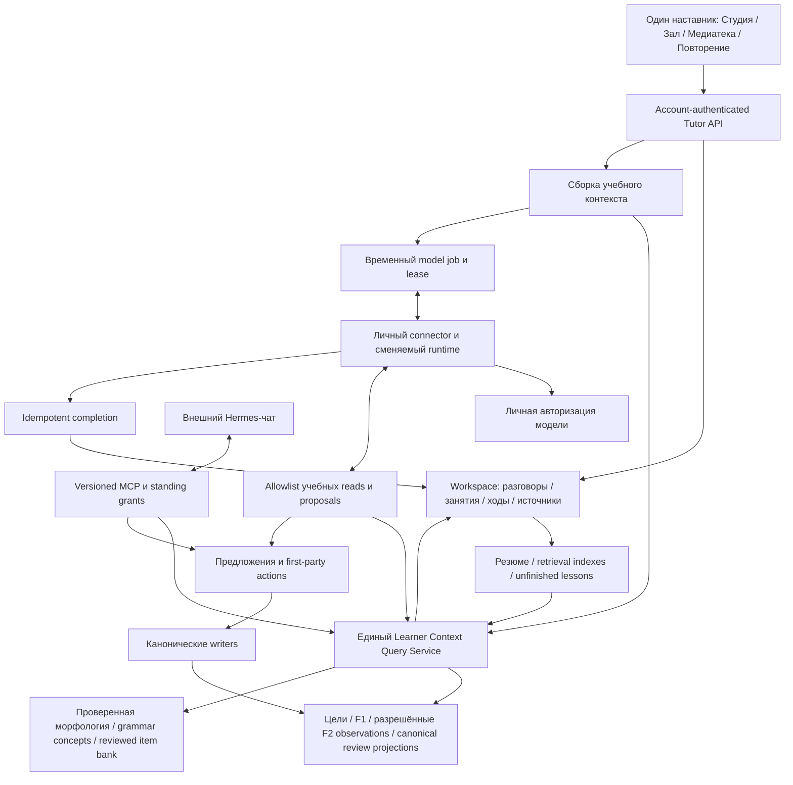

# Архитектура непрерывного личного наставника

Дата: 2026-09-30. Source baseline: `2509e9b1`. Статус: обязательный
implementation contract C1–C7; **новый runtime и persistent journal ещё не
реализованы**. Продуктовый канон:
[reset plan](MENTOR_PRODUCT_RESET_2026_09_30.md).

## 1. Границы и поток данных



Внутренний и внешний наставник используют одну историю, но могут иметь
разные активные разрешения. Встроенная модель не читает browser OPFS напрямую.
Ей доступны сохранённые account данные и переданное пользователем окно.
Весь локальный материал не загружается в облако в силу открытия наставника.

## 2. Сущности и lifetimes

| Сущность | Идентичность и обязательные поля | Время жизни / authority |
| --- | --- | --- |
| Learner workspace | `user_id`; текущие preferences, active goal refs, schema revision | Аккаунт; принадлежит пользователю, независимо от runtime |
| Conversation | Opaque `conversation_id`, `user_id`, title/topic, created/updated, version, deleted marker | До удаления/выбранной retention; не привязан к одной строке или connector |
| Lesson | `lesson_id`, conversation, declared objective, state, active source refs, next action, version | До завершения/удаления; продолжение через дни; отдельные source anchors |
| Turn | `turn_id`, conversation/lesson, parent turn, sequence, role, content, origin, timestamp, source/evidence refs, optional job receipt | Постоянная пользовательская история; student text и model text не становятся знанием/оценкой |
| Source snapshot | Immutable `source_ref`, user, material/revision/anchor, kind, caption revision/time, digest, excerpt, origin/authority | Сохранённое разрешённое окно разговора; не TTL вызова и не право на всю библиотеку |
| Attempt / feedback ref | Challenge/rubric/version, response ref, assistance, assessment authority, evidence ref | Canonical или advisory evidence по своему writer; chat turn ссылается, не дублирует оценку |
| Learner observation | Skill/concept/word ref, observation kind, help, timestamp, evaluator/source refs, uncertainty | Evidence projection; exposed ≠ recalled ≠ produced ≠ delayed transfer |
| Memory summary | revision, covered event range, evidence refs, model/policy provenance, correction/supersession state | Производная проекция; воспроизводится/инвалидируется; не единственный источник истории |
| Retrieval index | user, entity refs, source revisions, index version | Производный; удаляется/перестраивается вместе с source data |
| Model job | `job_id`, turn/lesson refs, protocol version, source/context envelope, lease, token budget, request/result hashes | Короткий TTL/lease; не является conversation или lesson |
| Shared handoff | connection, context/turn ref, expiry/revocation | Одноразовое дополнительное разрешение; не единственный доступ наставника к истории |

Постоянное содержимое разговора — пользовательские данные класса C с отдельным
включением сохранения. Prompt/model job — временная производная класса D.
Постоянная conversation не означает бессрочного хранения каждого prompt,
скрытых рассуждений, bearer token, raw audio или provider debug log.

Базовая политика C1: сохранённая история остаётся до удаления пользователем или
удаления аккаунта; пользователю это объясняется при включении. Storage quota
ограничивает объём явно, а не удаляет старые уроки молча. Конкретные пределы
хранилища и backup retention фиксируются до production migration по capacity
inventory; превышение сохраняет draft локально и показывает pending/error.
Raw audio по умолчанию ephemeral, transcript — только в рамках выбранного режима.

Переименование/удаление материала не переписывает historical snapshot. Если
материал изменился, source ref помечается как исторический; новый вопрос может
создать новый anchor в той же conversation. Старое упражнение не получает
незаметно новую редакцию.

## 3. Запись и канон

`tutor_sessions` сохраняет обязанности job queue до совместимой миграции.
Новый persistent слой не имеет `ON DELETE CASCADE` к tutor connector, OAuth
connection или ephemeral session. Связь с job после sweep остаётся receipt/ref,
не FK, уничтожающий обучение. Cascade аккаунта и explicit erasure сохраняются.

Completed job принимается транзакционно с append хода и completion receipt.
Идемпотентность — account + request/turn key; повторная доставка того же
result даёт прежний receipt. Другая версия результата по уже принятому ключу
отклоняется. Cancelled/failed/expired jobs не создают фиктивный completed
ответ; пользовательский вопрос и draft могут оставаться с фактическим статусом.
Потеря вкладки после завершения не приводит к потере ответа.

Продолжение задаёт `conversation_id`, `lesson_id`, parent/version/cursor,
а не обязательный `previous_session_id` ещё живого job. Несколько устройств
не перезаписывают друг друга: immutable turn IDs, monotonic server sequence,
idempotent outbox и explicit conflict для несовместимого изменения lesson.
Время импортированного старого хода помечается как client-reported.

Журнал разговора не становится вторым learner event log. Review attempt
записывается только существующим canonical writer; turn хранит ссылку на
receipt. Диагностика/объяснение/summary не пишут `review_log`, FSRS, mastery.
Для новых педагогических observations нужны совместимые versioned contracts
F2/learner evidence, а не новая таблица «model thinks mastered».

## 4. Доступ и согласие

Основная пользовательская возможность: **«Наставник помнит мои занятия»**.
Включение объясняет хранение разговоров в аккаунте и использование истории
выбранным личным агентом. Первая настройка оформляет нужные разные согласия
за один понятный маршрут, с видимой возможностью ограничить память.
Режим помощи без сохранения доступен; у него честно нет долгой памяти.

Backend отдельно проверяет:

- сохранение истории аккаунта и её content retention;
- использование этой истории текущим встроенным connector;
- standing OAuth read выбранного внешнего агента;
- права на дополнительный source body вне сохранённых окон разговора;
- proposals и first-party execution;
- микрофон/уведомления как отдельные возможности.

Старый `selected_fragment_v1`, cloud sync или четыре tutor MCP scopes не
разрешают массовый импорт прошлых разговоров и чтение всего архива.
Новое versioned consent выдаётся действительным пользовательским действием,
без скрытого обновления токена/enum. После активации не нужны повторные
handoff, permission checkbox или clipboard для каждого обычного вопроса.

Standing grant действует до отзыва/expiry authorization, а не до конца
последнего job. Каждый read/query/result acceptance проверяет account,
current connection, scope/version и статус удалённых данных. Старые context
packs не доставляются после удаления или отзыва: перед dispatch проверяется
content revision/authorization generation. Refresh/re-pair не возвращает
ранее отозванные grants автоматически.

Отзыв доступа агента сохраняет историю пользователя и останавливает будущие
reads/jobs; «удалить историю» удаляет содержимое и производные данные.
Пользователю объясняется различие. Уже полученные внешним агентом/provider
копии могут сохраняться у него; revoke не обещает их удаление.

## 5. Единый query service и новые MCP контракты

Все нижеследующие имена **предлагаемые**. Они не зарегистрированы в текущем
MCP. Closed schemas, scope migration, version negotiation и consent
реализуются до advertisement. Старые `aa.tutor_session.1.0.0` и
`get_agent_connection` не меняют семантику молча.

| Операция | Вход | Ограниченная выдача |
| --- | --- | --- |
| `get_mentor_context` | optional lesson/conversation; requested locale | Profile/preferences, declared goals, unfinished work, relevant history refs, evidence freshness, unknowns, available actions |
| `list_mentor_conversations` | query/goal/material filters, opaque cursor, limit | Исторические темы/даты/source refs, состояние занятия, matched turn refs; account isolation |
| `read_mentor_conversation` | conversation, opaque cursor, limit | Порядок реальных turns, content origin, source/evidence refs, paging/truncation labels |
| `read_mentor_source` | сохранённый source_ref | Точное разрешённое окно разговора/редакции; не произвольный material body |
| `get_learning_evidence` | skill/word/concept, bounded time range/cursor | Самостоятельные/assisted observations, provenance, давность, uncertainty; без arbitrary grade write |
| `propose_lesson_next_step` | lesson/version, evidence refs, bounded proposal | Preview следующего занятия/упражнения; сервер проверяет refs, доступ и writer |

Scope families проектируются по данным: mentor history/context read,
evidence read и lesson proposals. Пользователь видит понятные группы,
а не внутренние технические scopes. Отдельная tutor resource metadata должна
по-прежнему ограничивать OAuth до этих учебных прав. Нельзя перейти на общий
endpoint со всеми инструментами ради устранения короткого TTL.

Query service общий для API/context assembler/MCP. First-party cookie/CSRF,
connector credential и OAuth bearer имеют отдельные boundary adapters;
user_id берётся из authenticated principal. Cursor привязан к account,
query и snapshot/version; чужой/изменённый cursor не даёт выдачу. Лимиты
размера/count и typed отказ обязательны. Source/LLM text всегда untrusted.

Поиск: сначала exact source identity, lesson/goal refs, chronology и lexical
query; затем validated semantic retrieval, если нужен для проверенных
scenarios. C1 обязан находить прошлые занятия и при обычном перефразировании
запроса; exact ID test недостаточен. Семантический индекс не отменяет grants,
удаление или source authority и не отправляет весь архив стороннему API.
Выбор реализации проверяется retrieval-набором и бюджетом; скрытый paid
embedding provider не допускается.

## 6. Контекст и агентская оркестрация

Перед обычным ответом собирается `MentorContextPack` с versioned полями:

```text
context_pack_id, schema_version, lesson_id, conversation_id, snapshot_revision
current_question, current_source_refs, selected_source_window
user_declared_goals, explanation_preferences, available_time
unfinished_work_refs, relevant_turns_with_source_refs
learning_observations_with_authority_help_freshness
verified_language_facts, memory_summary_revision_and_evidence_refs
known_unknowns, omitted_context_labels, allowed_operations, token_budget
```

Principal/grant tokens остаются вне model payload. Сборка приоритизирует
текущий вопрос и точный source, затем действующую цель/unfinished work,
релевантное прошлое и проверенные факты. Случайные последние N сообщений
или бесконечный полный transcript не являются retrieval policy.

Если нужное прошлое не вошло в pack, агент вызывает разрешённые reads.
Инструменты возвращают refs, provenance и страницу continuation. Отсутствие
матча или доступа не означает, что события никогда не было; наставник
формулирует ограничение и уточняет. Сводка не заменяет оригинал, когда
важна точная собственная реплика/ошибка.

`hermes_turn.py` заменяется/расширяется через pinned educational adapter:
allowlist history/context, morphology, evidence, reviewed practice и proposals;
bounded tool loop, timeout, quota/cancel/revoke, no auxiliary paid fallback.
Shell/filesystem/email/network browsing/self-modifying skills не нужны.
Runtime-global owner memory и бытовая история не смешиваются с обучением.
Сохранение изоляции temporary home допустимо, если данные получаются через
общий query service. Не требуется привязывать память ученика к процессу Hermes.

Реализация tool bridge зависит от фактического pinned runtime API. До закрытия
C1.3 нужен integration spike с настоящим runtime и synthetic account:
модель самостоятельно делает целевой read, получает отсутствовавшее в pack
событие и продолжает ответ; fixture, обход с предварительной подстановкой
текста и вызов SDK оператором этот gate не закрывают. Изменение runtime
version/provider route проверяется отдельно.

Job protocol поддерживает capability handshake. Старому runner нельзя
незаметно отправить `history` нового формата/большой pack: он получает
совместимый ограниченный режим или понятное upgrade-required. Текущее
ограничение stdin 40 KB, relay 64 KB и четыре turns учитывается до migration;
новые budgets и schemas согласуются в server/connector/runner вместе.

## 7. Педагогическая модель и поведение

История отвечает «что мы делали». Evidence отвечает «что получилось и при
какой помощи». Declared goal отвечает «чего хочет ученик». Language knowledge
отвечает «что правильно и на каком источнике». Эти категории не взаимозаменяемы.

Пять режимов одного наставника: объяснить, потренироваться, обсудить,
проверить написанное, выбрать/продолжить занятие. Переключение естественное
внутри разговора; не пять независимых ботов. Прямой вопрос получает прямой
ответ; практика предлагается уместно, без обязательного экзамена.

Next-step selector использует реальную цель, разрешённые due items,
unfinished work и проверенные observations. Причина содержит evidence refs.
Без данных — выбор цели/интереса или короткая диагностическая попытка с
оговорённой authority, а не диагноз по самому вопросу или процент по чатам.
Skip, «позже», показ перевода и ошибка ASR не считаются незнанием автоматически.

Для первого цикла C2 выбирается малая reviewed construct family, например
различение лица в прошедшем времени, после проверки эталонов. Источник
подсказывает контекст, reviewed bank/rubric проверяет самостоятельную
попытку, следующий материал и отложенная попытка проверяют перенос.
Feedback предлагает одну приоритетную правку собственной реплики.
LLM не утверждает знание на основании собственного объяснения/ключа.

Summaries создаются инкрементально по versioned covered ranges без новой
генерации на каждый клик. Фактическое утверждение имеет event/evidence refs;
неподтверждённая интерпретация явно помечена. «Исправь, я это уже понимаю»
обновляет declared state/помечает спорный inference, но не фабрикует
assessment result. Человек может посмотреть и исправить память.

Инициатива использует Silent/Coach/Intensive, batching/cooldown и одну
объяснимую рекомендацию. Optional reminders используют существующий канал
и SRS; Hermes cron не создаёт конкурирующее расписание. Оффлайн сохраняются
чтение, прежняя история, local drafts и deterministic practice; generation
явно ожидает runtime/квоту.

## 8. Миграция локального архива и старых данных

1. Read-only inventory: какие notebook schemas/owner IDs/source revisions
   существуют; server jobs/старые explanation artifacts; нельзя считать
   local 200-turn archive полной историей ученика.
2. Versioned history activation с честным объяснением, какие уже имеющиеся
   записи переносятся. До него не загружать legacy содержимое по старому scope.
3. Dry-run preview count/source identity; backup исходного local archive.
   Каждой imported записи присвоить origin `legacy_browser_import`,
   client-reported timestamp, idempotent import key; model answer не получает
   teacher_verified label. Не восстанавливать утраченное догадкой.
4. Transactional import, reconciliation report, repeat import = zero new
   rows; сохранять source anchors/digests и question/answer полностью.
5. Canon transition: после lossless read-back server journal — canonical
   synced history, IndexedDB — cache/outbox. Pending local rows видимы,
   чужой account cache не смешивается, нет last-write-wins потери turns.
6. Старые jobs остаются ephemeral; автоматическое backfill личного текста
   без согласия не делается. Уже исчезнувшая история честно unavailable.

## 9. Экспорт, исправление, удаление и восстановление

Единый account export содержит conversation/lesson/turn/source snapshots,
актуальные и superseded summaries с происхождением, allowed evidence refs
и content-free erasure receipts; не содержит токены/служебные хэши/prompts
истёкших jobs. Пределы и формат версионируются, zip/json — сервисная функция
данных аккаунта, а не шаг учебного общения.

Удаление разговора/истории транзакционно удаляет содержимое, snapshots,
dependent summaries, retrieval index и cached context packs; сохраняет
минимальный content-free tombstone. Canonical review records имеют свой
пользовательский lifecycle: удаление чата не переписывает оценки и не
объявляется удалением всего аккаунта. Удаление аккаунта покрывает все данные.

Outbox/import проверяет erasure generation, поэтому старая browser copy
не воскрешает удалённый разговор. Уже отключённые устройства физически
не стираются сервером; при следующем входе применяется erasure sync.
Удаление после backup restoration replay проверяется на безопасном fixture;
срок существования private backups и downstream copies объясняется точно.

Исправление source/summary создаёт версию и invalidates dependent projections;
не переписывает исходный assessment receipt. User correction и спорная
assessment — разные actions. Audit хранит metadata действия без личного текста.

## 10. Acceptance и deploy

Обязательные наборы:
[maturity acceptance](MENTOR_MATURITY_ACCEPTANCE_2026_09_30.md).
Для C1 — новая DB migration, fixtures двух аккаунтов/двух агентов/двух
устройств, TTL/restart/re-pair, actual model retrieval, lossless archive
migration, erasure replay и owner обычный учебный маршрут.

Публичные UI/installer/version/SW/served asset contracts изменяются совместно.
Production rollout остаётся ограниченным owner pilot до новых gates;
новые OAuth rights получают реальное согласие. Никакие user data, provider
credentials, оплаченные artifacts и старый Hermes chat не стираются для
облегчения перехода. Production lineage/bytes/image/health и owner evidence
сохраняются отдельно от педагогических результатов.
