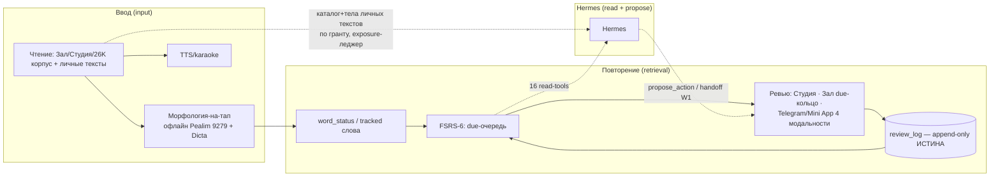
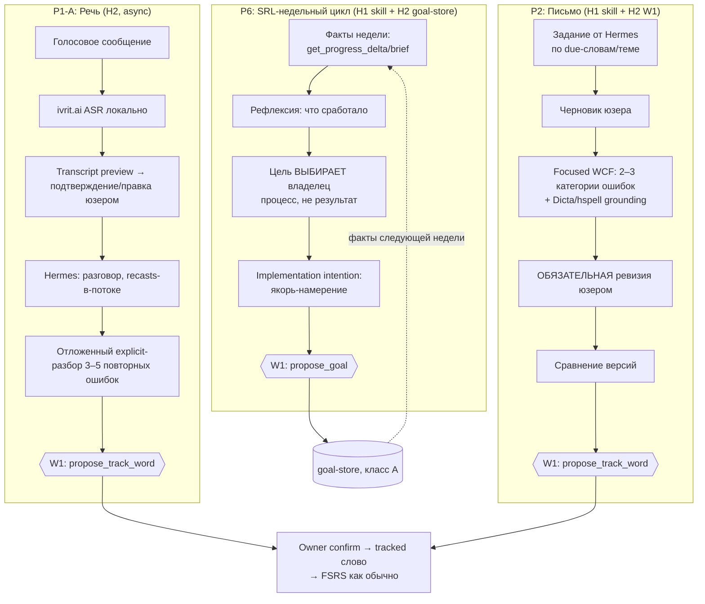
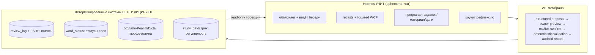

# 01 — Целевая образовательная архитектура (петли обучения)

Как читать: §1 — что уже работает (текущие петли, по живому коду v3.11.221); §2 — целевые петли
H1/H2 (speaking, writing, SRL); §3 — сквозная граница «Hermes teaches / deterministic systems
certify»; §4 — спецификация каждой петли по единой сетке.

## 1. Текущие петли (input + retrieval) — работают, не трогаются

Свойства, которые обязаны сохраниться: review_log — единственная истина памяти;
FSRS — единственный scheduler; грейд детерминированный; агент читает проекции, пишет только
предложения (W1) и single-use handoff-ссылки.

## 2. Целевые петли (добавляются, ничего не заменяют)

## 3. Граница «Hermes teaches / deterministic systems certify»

Hermes никогда не утверждает: «слово освоено», «уровень повышен», «ошибка устранена», «цель
достигнута». Такие суждения — только пересказ детерминированных данных с указанием источника.

## 4. Спецификация петель

Сетка: trigger · inputs · agent behavior · deterministic grounding · user action · output artifact ·
W1 proposal · каноническая запись · измерение.

### 4.1 Разговорная сессия (P3, H1.1 — доступно без кода LinguistPro)

| Поле | Содержание |
|---|---|
| Trigger | Юзер начинает сессию (или принимает нудж) |
| Inputs | get_due_review_items (5–8 слов), тема из личного текста/песни (list_personal_texts + get_personal_text_content по гранту) |
| Agent behavior | State machine 06 §3: negotiated interaction, recasts-в-потоке, clarification requests, отложенный explicit-разбор |
| Grounding | Морфо-утверждения — H1: только по фактам из карточек/текстов LinguistPro + честное «не уверен»; H2: обязательная сверка get_word_morphology |
| User action | Отвечает на иврите (текст; голос — с H2) |
| Artifact | Ephemeral (чат); пост-сессионный разбор — сообщение |
| W1 | propose_action(note) с итогом; H2+: propose_track_word |
| Канон. запись | Никакой автоматической; подтверждённые слова → обычный track-путь |
| Измерение | Сессий/нед, реплик юзера на иврите за сессию, повторные ошибки (08 §2) |

### 4.2 Письмо с WCF (P2, H1.2)

| Поле | Содержание |
|---|---|
| Trigger | Юзер просит задание / принимает предложение из брифа |
| Inputs | Due-слова, тема; уровень из get_learner_profile |
| Agent behavior | Задание → черновик → focused WCF (≤2–3 категории за цикл) → обязательная ревизия → сравнение |
| Grounding | H1: орфография — осторожно, с оговорками о неуверенности; H2: Dicta/hspell перед утверждениями об ошибках |
| User action | Пишет и ревизирует черновик |
| Artifact | Ephemeral по умолчанию (Д1); хранение — только после отдельного owner-решения |
| W1 | propose_track_word из повторных ошибок (H2) |
| Канон. запись | Нет автоматической |
| Измерение | Ревизированных черновиков/нед, повторные категории ошибок, retry success |

### 4.3 SRL-ретроспектива (P6, H1.3)

| Поле | Содержание |
|---|---|
| Trigger | Еженедельно (вс) — юзер инициирует или принимает нудж |
| Inputs | get_progress_delta(since=−7d), get_learning_brief, прошлая цель (H1: из чат-заметки/propose_action note; H2: goal-store) |
| Agent behavior | Факты → рефлексия → юзер ВЫБИРАЕТ цель (агент предлагает ≤3 варианта процесса-целей) → implementation intention |
| Grounding | Только детерминированные числа из read-tools; агент не «оценивает прогресс» сверх них |
| User action | Выбирает цель и якорь |
| Artifact | Цель недели |
| W1 | H1: propose_action(note, title="Цель недели …"); H2: propose_goal → goal-store |
| Канон. запись | H2: goal-store (класс A), owner-confirmed |
| Измерение | Регулярность цикла (нед подряд), goal adherence, сессий/нед |

### 4.4 Речевая петля async (P1-A, H2.6)

| Поле | Содержание |
|---|---|
| Trigger | Голосовое сообщение юзера |
| Inputs | Audio (локальная обработка) → ivrit.ai ASR → transcript + confidence + timestamps |
| Agent behavior | Transcript preview (юзер подтверждает/правит) → разговор как 4.1 + пометка ASR-неуверенных мест |
| Grounding | ASR-транскрипт = гипотеза, не факт; произносительный скоринг ЗАПРЕЩЁН (H3-чартер C1) |
| User action | Подтверждает транскрипт, продолжает голосом/текстом |
| Artifact | Transcript (consent-класс по Д1/Д7); raw audio НЕ хранится (Д7) |
| W1 | propose_track_word (с пометкой «ошибка транскрипции?» — см. 04 §propose_track_word) |
| Канон. запись | Нет автоматической |
| Измерение | Минуты речи/нед, ASR correction rate, повторные ошибки |

### 4.5 Песенный контур (P5, H1.6 + H2)

| Поле | Содержание |
|---|---|
| Trigger | Юзер называет песню / агент подбирает по due-словам |
| Inputs | LRCLIB (синк-LRC), YouTube-transcript, Sefaria (интертексты), kaikki/wordfreq |
| Agent behavior | Разбор строк с due-словами, narrow listening цепочки, микро-упражнения «услышь слово на таймстампе» |
| Grounding | Тексты из LRCLIB = непроверенный источник (R11): показываются как «внешний текст», не перезаписывают ничего |
| User action | Слушает/читает/отвечает |
| Artifact | Ephemeral; понравившийся текст → W1 propose_import_text (H2) |
| W1 | propose_import_text → полный конвейер (морфология, TTS, SRS) после owner confirm |
| Канон. запись | Импортированный текст — через детерминированный import-путь Библиотеки |
| Измерение | Импортов/нед, покрытие импортированного (get_text_coverage, H2) |

### 4.6 i+1 подбор материала (P4, H2.2)

| Поле | Содержание |
|---|---|
| Trigger | «Что почитать?» / подготовка сессии |
| Inputs | get_text_coverage(text) → token/lemma coverage по word_status |
| Agent behavior | Рекомендует материал с 95–98% покрытием, называет ЧИСЛО и целевые слова, а не «кажется подходит» |
| Grounding | Расчёт серверный детерминированный; версии projection/resolver в ответе |
| User action | Выбирает материал |
| W1 | — (read-only петля) |
| Измерение | % покрытия фактически читаемого, доля рекомендаций принятых |
