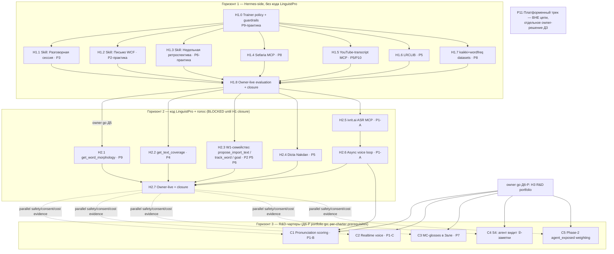

# 02 — Dependency DAG и секвенирование (P1–P11 × H1–H3)

## 1. DAG

## 2. Типы зависимостей

| Ребро | Тип | Почему |
|---|---|---|
| H1.0 → все H1-слайсы | educational | Скиллы и интеграции обязаны наследовать общую trainer policy; иначе N расходящихся политик |
| H1.* → H1.8 → H2 | evidence | H1 engineering + owner smoke закрываются до H2; по owner amendment 2026-07-23 longitudinal continuation evidence собирается обязательным 14-дневным мониторингом параллельно H2 и может остановить дальнейшее расширение (08 §3) |
| H2.5 → H2.6 | technical | Async voice невозможен без работающего локального ASR |
| H2.1 → (усиливает H1.1/H1.2) | educational | Морфо-grounding убирает главный риск роста роли агента (галлюцинации форм); до него скиллы работают в режиме «честное не уверен» |
| H2.3 propose_goal → полный SRL | technical | До goal-store цель недели живёт как note (H1.3 деградированный, но рабочий режим) |
| H2.6 → C1 | evidence+technical | Скоринг произношения строится на ASR-пайплайне и накопленных транскриптах |
| H2.7 ∥ H3 после Д6-P | governance | Owner amendment 2026-07-24 снимает только глобальную последовательностную блокировку. Незакрытый H2 consent/cost audit остаётся обязательным и его stop condition останавливает затронутый H3 path; prerequisites каждого чартера не ослаблены |
| consent: Д1 → хранение продукции | consent | Хранение produced-output требует нового scope и церемонии (07 §4) |
| Все внешние интеграции → R16-конверт | operational | 09: каждый ресурс получает cost/fallback-строку до включения |

## 3. Параллелизация H1

- **H1.1 ∥ H1.2 ∥ H1.3** — независимые скиллы, общий предок только H1.0. Разными Codex-сессиями — можно одновременно.
- **H1.4 ∥ H1.5 ∥ H1.6 ∥ H1.7** — независимые интеграции; каждая — отдельная сессия. ⚠ Все четыре меняют один файл `~/.hermes/config.yaml` (Hermes-side) — при параллельной работе мержить аддитивно, конфликт тривиален.
- H1.8 — строго последний, один; он закрывает H1 и запускает отдельный
  monitoring ledger, который после Д5 может идти параллельно H2.
- Скилл-группа и интеграционная группа взаимно независимы (скиллы H1 работают без новых MCP; интеграции полезны без новых скиллов) — допустим любой порядок групп, рекомендован скиллы-первыми (быстрее owner-value).

## 4. Что нельзя начинать до H1 closure и Д5

- **Весь H2**: код LinguistPro (новые инструменты, миграции goal-store) —
  только после G-H2-START (10 §3): H1 CLOSED и явный owner go Д5.
- Owner amendment 2026-07-23 переносит только longitudinal evidence в
  параллельный monitoring. Он не разрешает H2 до H1 closure/Д5 и не ослабляет
  W0/W1, consent, schema или production gates.

## 5. Что в H3 является R&D, а не delivery

Все пять чартеров (05): вопрос «возможно ли с приемлемым качеством», а не «сделай фичу».
Выход чартера — evidence-отчёт + go/no-go рекомендация, НЕ код в проде. Провал чартера — валидный
результат (особенно C1: готового иврит-скоринга не существует в мире — 03_TECH §1.4).

Owner decision Д6-P от 2026-07-24 разрешает портфель C1–C5 без повторного owner-go на каждый
research charter. Запуск всё равно per-charter: только после фактической проверки его prerequisites,
cost/privacy условий и отсутствия релевантного active stop condition из H2 monitoring. На дату
решения C3 — единственный runnable чартер; C1/C2/C4/C5 остаются evidence-blocked.

## 6. Почему P11 не блокирует и не блокируется

P11 (протокол как продукт/стандарт) не имеет общих артефактов с H1–H3: он про документацию,
позиционирование и второго агента-клиента, не про учебные петли. Любая попытка «заодно
стандартизировать протокол» внутри H2-слайса = scope creep, отклонять. Единственная связь:
H2-контракты (04) написаны версионированно и додокументированы настолько, что P11 сможет их
переиспользовать без переделки — это бесплатный побочный эффект, не зависимость.
