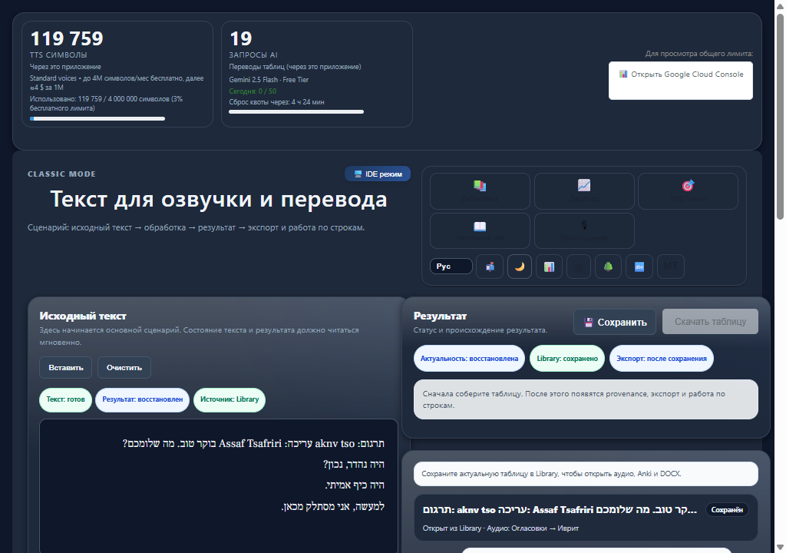
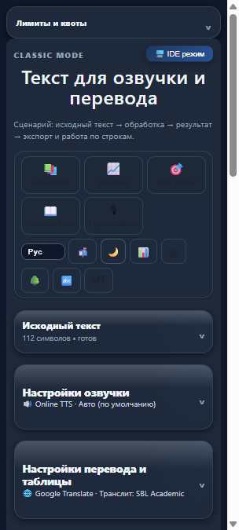
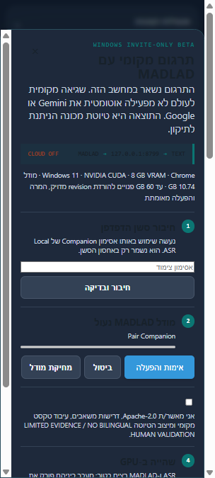

# Studio Ingest L4-MT — MADLAD productization evidence

Date: 2026-08-04; production activation refreshed 2026-08-05; authority: D-HNR-10;
served web package/service worker: `3.11.308`;
invite Companion source version: `0.3.0-beta.4`.
Status: **AUTOMATED PASS / LOCAL BINARY PASS / PRODUCTION ACTIVATED / BROWSER ROUND-TRIP PARTIAL / OWNER-LIVE NOT STARTED**

## Outcome

The implementation now has one authenticated Browser→Companion MADLAD route. Browser
traffic is limited to `http://127.0.0.1:8799/v1/mt/*`, shares the existing session pairing
token, and has no cloud fallback. The production server rejects `provider=madlad` before
translation and no longer reports server MADLAD as configured.

The main table, Text Card Builder, and Material Revision use the same local batch/mapping
adapter. Material Revision deliberately regenerates only the unlocked `ru` field for
MADLAD; niqqud and transliteration remain under their prior or invalidated authorities.
Saved rows continue to use the D-HNR-9 authority fields `translation_provider` and
`translation_meta_json`, including exact model revision and `local_execution=true`.

## Stage ledger

| Stage | Engineering status | Evidence / remaining gate |
| --- | --- | --- |
| MT-0 | PASS, committed as `24cc2b54` | False server status reproduced and fixed; server MADLAD route fails closed; no provider switch. |
| MT-1 | Local PASS | Authenticated capabilities/lifecycle/jobs, Origin/PNA/token negatives, anti-replay, exact cardinality and cancel tests are green. Not production-verified. |
| MT-2 | Local source + frozen binary PASS | Cancel/resume and all 42,854,943,654 source bytes exact-hashed. Two independent FP16+low-memory conversions reproduced the same `model.bin`; the frozen release subset passed, so the runtime was repinned as `madlad-400-10b-ct2-int8f16@v2`. The beta.4 binary then completed delete→absent→remote reinstall, survived a transient network failure by resuming the retained partial, converted, activated and fully rehashed all 53,594,568,780 lifecycle bytes. The 22 GiB gate remains; the binary conversion reached 0.96 GiB available RAM. |
| MT-3 | Local binary PASS / production-origin save-edit-cold-reopen PASS / import pending | A real binary smoke exposed that blank input could reach MADLAD and hallucinate output. The runtime now bypasses inference for blank/whitespace segments and preserves their exact bytes. On served `3.11.308`, a real Chrome job produced two rows, saved a new Library card, filtered it by MADLAD, showed exact `@v2` local provenance, edited it and cold-reopened both rows. Text-card export UI reported success; re-import still requires the owner to select the downloaded JSON in Chrome. |
| MT-4 | Local browser PASS for unavailable/onboarding states | Fresh Chrome, desktop and exact 380 CSS px; RU/EN/HE live localization and Hebrew RTL; no horizontal overflow. Ready/install/busy actions still need the built invite Companion. |
| MT-5 | LOCAL PASS / PRODUCTION PARTIAL | 66 Python, 29 focused Node and 233 i18n checks pass; browser provenance and Studio chunk smokes pass. A served-origin Chrome translation, save/filter/edit/cold-reopen and Companion-off fail-closed proof pass. File-picker import and owner-live remain separate gates, so `PRODUCTION PASS` is not declared yet. |
| MT-6 | INTERNAL BINARY PASS / DISTRIBUTION CLOSED | The exact beta.4 installer builds from commit `ce811de7` with clean runtime inputs, pinned Torch/Accelerate, frozen runtime self-check and isolated start/health/stop. Its 5,304-file installed tree matches final dist by path/size/SHA; pairing, ASR and v2 survive upgrade. The artifact is unsigned/internal-only; no public hosting, signing, GA or default-on is authorized. |
| MT-7 | PRODUCTION ACTIVATED / HEALTH PASS | `HEAD=origin=served` commit `015c0a05`, app/SW `3.11.308`. A fresh online SQLite backup (`integrity_check=ok`) was created before mutation. The refreshed bounded cleanup removed exactly four unused app images plus build cache, improving root 92%→76% and free space 3.1→9.0 GB while preserving active/rollback images, 10 containers, 3 volumes, backups and data. `LOCAL_MT_BETA_ENABLED=true` is served by one fresh active container; health/DB/migrations and `disk_warn=false` pass. |

## Security and privacy assertions

- `/v1/capabilities` and every `/v1/mt/*` endpoint use the existing strict Companion Origin,
  bearer-token, CORS and Private Network Access policy.
- The browser client contains no production `/api/*` route and no Gemini/GCP/Google Free
  fallback. Local failure and cancel stay on loopback.
- Model/install errors are code-based and exclude local paths, tokens and source text.
- The browser exposure flag is independent and default-off: `LOCAL_MT_BETA_ENABLED=false`.
- The invite Companion enables the MT capability only inside that explicitly installed
  cohort; browser enrollment and provider selection remain explicit.

## Real-model smoke (not bilingual validation)

Environment: Windows, NVIDIA GeForce RTX 3070 8 GB, driver 595.79. The original v1
scheduler smoke loaded in about 51.0 seconds. After the v2 repin, the owner-managed v2
runtime loaded in 14.852 seconds, translated four synthetic rows in 5.390 seconds and
returned GPU use to 497 MiB after unload.

Synthetic results:

- `שלום עולם.` → `Мир во всем мире.`
- `זהו מבחן מקומי.` → `Это локальная проверка.`
- `Привет, мир.` → `שלום, עולם.`
- `Это локальный тест.` → `זה מבחן מקומי.`

The first result demonstrates a material ambiguity/meaning risk. This is why all local
outputs remain correctable machine drafts marked
`LIMITED EVIDENCE / NO BILINGUAL HUMAN VALIDATION`. This smoke is runtime evidence only;
it is not owner-selected material and not an owner-live semantic PASS.

## Evidence index

- `COMMANDS.md` — commands and gate outcomes.
- `environment.json` — content-safe environment and revision snapshot.
- `model-manifest.json` — runtime identity, exact sizes and SHA-256 values.
- `raw/real-model-smoke.json` — normalized synthetic translation output.
- `raw/real-model-smoke-v2.json` — managed v2 load/translation/unload receipt.
- `raw/fresh-install-attempt.json` — cancel/resume/download/hash/conversion/adoption receipt.
- `raw/fp16-remediation.json` — measured dtype mismatch, two controlled retries, RAM floor and v2 resolution.
- `release-regression-contract.json` — subset and thresholds frozen before candidate inference.
- `raw/release-regression.json` — v1→v2 metric/cardinality/diagnostic verdict.
- `raw/gpu-swap.json` — real ASR→MT→ASR residency receipt.
- `raw/production-cleanup.json` — bounded production cleanup and post-health receipt.
- `raw/production-preflight-final.json` — refreshed served/health/disk/Docker/rollback/
  backup snapshot and the concurrent-main deployment stop.
- `raw/production-beta-activation.json` — 2026-08-05 backup, bounded cleanup, runtime
  activation and real Chrome production-origin receipts.
- `raw/beta4-binary-lifecycle.json` — build, upgrade, blank-row remediation,
  delete/reinstall/resume, multi-tab and restart receipts.
- `known-limitations.md` — incomplete exits and STOP conditions.
- `invite-beta.md` — bounded installer/upgrade state; distribution is not authorized yet.
- `screenshots/` — fresh desktop and 380px unavailable/onboarding evidence.

Screenshots:

